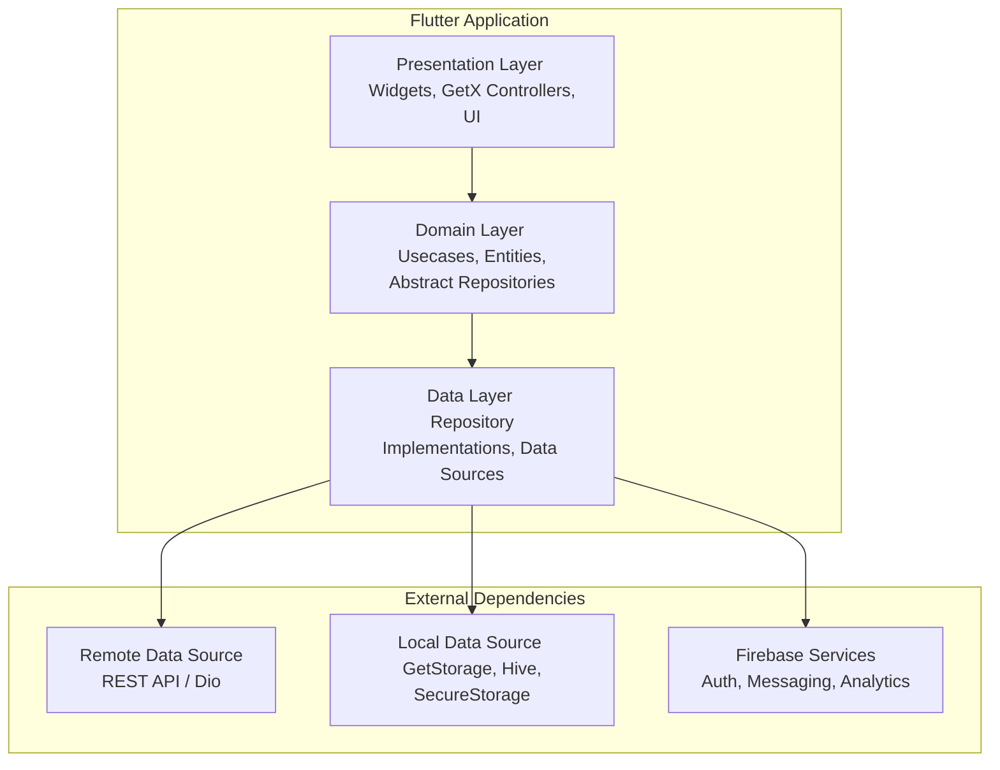

# Uni Service Clone

A comprehensive mobile application built with Flutter, designed to provide various university-related services. This project is structured following Clean Architecture principles for scalability and maintainability.

## 🏗️ Application Architecture

The application is built using the Flutter framework and follows the principles of Clean Architecture. This layered architecture separates the concerns of the application, making it easier to develop, test, and maintain.



---

## ✨ Key Features

This application includes a wide range of features to serve university students and staff:

- **Authentication**: Secure user login and registration using email/password and social providers (Google, Apple Sign-In).
- **Home Dashboard**: A central hub displaying user information, balance, and quick access to services.
- **QR Code System**:
    - **My QR**: Display a personal QR code for identification and transactions.
    - **Scan QR**: Scan QR codes for payments or other interactions.
- **Financial Management**:
    - **Deposit**: Top-up account balance.
    - **Transfer**: Send money to other users.
    - **Transaction History**: View a detailed list of all past transactions.
- **Ordering System**: Browse items and place orders from various vendors.
- **Account Management**: View and update user profile information.
- **Branch Information**: View details about different university branches or service points.
- **Push Notifications**: Receive real-time alerts and updates via Firebase Cloud Messaging.

---

## 🛠️ Technology Stack

The platform is built on a foundation of powerful and scalable technologies from the Flutter ecosystem.

| Category                  | Technology / Service                                       |
| ------------------------- | ---------------------------------------------------------- |
| **Framework**             | Flutter                                                    |
| **State Management**      | GetX                                                       |
| **Networking**            | Dio, Retrofit                                              |
| **Local Storage**         | GetStorage, Hive, Flutter Secure Storage                   |
| **Backend Services**      | Firebase (Authentication, Messaging, Analytics)            |
| **UI & UX**               | Material Design, Persistent Bottom Nav Bar, Flutter SVG    |
| **Asynchronous Programming** | Dart Futures & Streams                                   |
| **Form Handling**         | Flutter Form Builder                                       |
| **Localization**          | `flutter_intl`                                             |
| **Dependency Injection**  | GetX Bindings                                              |


---

<details>
<summary>🚀 Getting Started (For Developers)</summary>

### Prerequisites

- Flutter SDK (version 3.0.0 or higher)
- An IDE like VS Code or Android Studio
- Git

### Environment Setup

1.  **Firebase Setup**: This project uses Firebase for several core features.
    - **Android**: Place your `google-services.json` file in `android/app/`.
    - **iOS**: Place your `GoogleService-Info.plist` file in `ios/Runner/`.

2.  Clone the repository:
    ```bash
    git clone <your-repository-url>
    cd uni-service-clone
    ```

3.  Install dependencies:
    ```bash
    flutter pub get
    ```

4.  Generate required files:
    ```bash
    flutter pub run build_runner build --delete-conflicting-outputs
    ```

### Running the Application

1.  Select an emulator or a connected physical device.

2.  Run the application:
    ```bash
    flutter run
    ```

    You can also specify the flavor to run (dev, stg, prod):
    ```bash
    flutter run --flavor dev --dart-define="ENV=DEV"
    ```

</details>

## 🤝 Contributing

Contributions are welcome! Please feel free to fork the repository, create a feature branch, and submit a pull request.

## 📄 License

This project is proprietary. Please refer to the project owner for licensing information.
